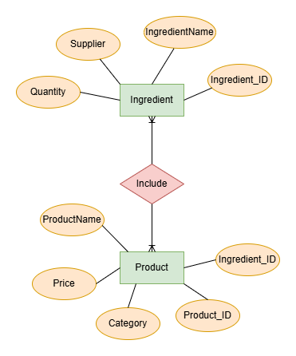

# Highlands Coffee - SQL Database Management & Data Cleaning

## Project Overview
This project focuses on designing a relational database system for Highlands Coffee to manage products, ingredients, and suppliers. It demonstrates the ability to translate business rules into an Entity-Relationship Diagram (ERD) and use MS SQL Server to solve daily operational tasks, particularly handling "dirty data" (e.g., text mixed with numerical values).

## Tools & Technologies
- **Database Management System:** Microsoft SQL Server
- **Techniques:** ERD Design, Data Cleaning (`REPLACE`, `TRY_CAST`), Aggregation (`GROUP BY`, `SUM`), Relational Schema.

## Repository Structure
- `highlands.sql`: DDL and DML scripts to create tables (Product, Ingredient) and insert raw data.
- `Query.sql`: 10 business-driven queries for operational reporting.
- `data_manage_products_at_Highlands_coffee.xlsx`: The raw dataset containing product prices and ingredient quantities.

## Key Business Solutions & Data Cleaning
Unlike standard clean datasets, real-world data often contains units mixed with numbers (e.g., "50Kg", "20 hộp"). This project highlights the use of SQL string manipulation to clean data on the fly for financial calculations.

**Example: Calculating total assumed revenue by stripping text strings**
```sql
SELECT SUM(Price * TRY_CAST(REPLACE(REPLACE(Quantity, 'Kg', ''), 'hộp', '') AS INT)) AS Total_Revenue
FROM dbo.Product, dbo.Ingredient
WHERE Ingredient.Ingredient_ID = Product.Ingredient_ID;
```

## Entity-Relationship Diagram (ERD)

